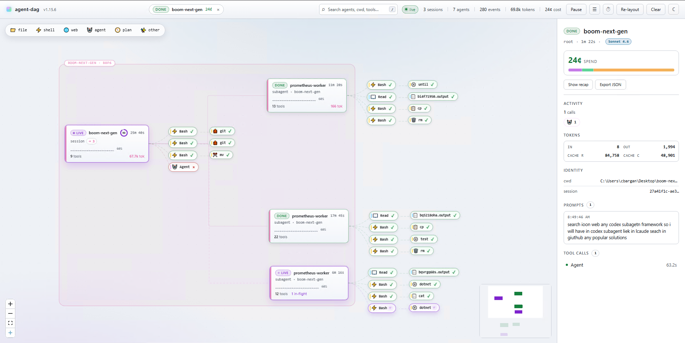

<div align="center">

# ccdeck

**A live canvas for your AI agents.** Watch Claude Code and OpenAI Codex fork subagents, call tools, and finish — all on one calm graph, in real time.

[](https://www.npmjs.com/package/ccdeck)
[](https://www.npmjs.com/package/agents-deck)
[](LICENSE)
[](https://nodejs.org)
[](#requirements)

```bash
npx ccdeck
```



</div>

---

## Why

An agent session is a tree, but a terminal shows it as a scroll. Five subagents working in parallel arrive as one interleaved column of text, and the questions you actually have — *what is running right now, what did that subagent do, which one is stuck, what is this costing* — are the ones the scroll answers worst.

ccdeck draws the tree instead. It is read-only, local, and needs no configuration: it registers a hook, listens, and paints.

## Quick start

```bash
npx ccdeck          # or: npx agents-deck · npx agent-dag — same package
```

Opens **http://127.0.0.1:4317** and registers the Claude Code hook on first run. Start any Claude Code or Codex session and the graph fills in live. `Ctrl+C` stops it.

No config file. No account. No telemetry — nothing about your sessions is reported anywhere. What does go out is short and ordinary: a ~20-byte version check against the npm registry, installs and daily version checks for the two tools the deck manages (claude-swap from PyPI, ccusage from npm), and, while the page is open, quota reads to Anthropic and OpenAI signed with your own credentials — that is where those numbers live. `AGENTS_DECK_NO_INSTALL=1` turns off everything but the quota reads.

## What you get

| | |
|---|---|
| **Live DAG** | Nodes are agents, edges are spawns and tool calls. In-flight edges animate, settled ones fade. |
| **Both providers, one canvas** | Claude Code through hooks, Codex through its rollout log. The model chip (`Opus 5`, `GPT-5.5`) tells them apart. |
| **Click to inspect** | Any node opens its prompt, tool calls, token usage and timing. |
| **Cost and quota, live** | Spend per model and per session, plus Claude and Codex quota windows as they refill. |
| **Survives restarts** | Events are appended to `~/.claude/agent-dag/events.jsonl` and replayed on open. |
| **Accounts without a terminal** | Sign a new Claude account in, share one to another machine, rename, reorder, remove — from the panel. |
| **Knows when it is stale** | Node caches modules at startup, so an upgraded-while-running deck keeps executing old code. This one says so, and can restart itself when nothing is running. |
| **Workspace scoping** | `--scope` for the current directory, `--workspace <path>` for any subtree. |

## How it works

Two capture paths feed one SSE stream, which feeds one canvas.

**Claude Code** — on first run, ccdeck adds a hook entry to `~/.claude/settings.json` for every relevant event:

```
SessionStart · UserPromptSubmit · PreToolUse · PostToolUse · PostToolUseFailure
SubagentStart · SubagentStop · Stop · SessionEnd · Notification
```

Each one fires the bundled `hook.js`, which POSTs the event JSON to the running server. The hook is fire-and-forget with a 1-second timeout: if the deck is not running, your session is not slowed down and nothing fails.

**OpenAI Codex** — Codex CLI hooks do not fire reliably on Windows, so nothing is installed at all. The server tails Codex's own rollout files at `~/.codex/sessions/YYYY/MM/DD/rollout-*.jsonl` and reconstructs the equivalent stream — session start, prompts, tool calls, token usage, model. No hook install, no trust prompt. Set `CODEX_HOME` to override the path.

## Accounts

The Accounts panel reads the store [claude-swap](https://pypi.org/project/claude-swap/) keeps, and can drive it.

**`+` → Sign in** runs `claude auth login`, shows you the link, takes the code your browser gives back, and hands the result to `cswap add`. The account you were using **stays active** — signing in replaces the live credentials, so the previous one is switched back the moment the new one is recorded. The code goes straight into the CLI's stdin on this machine; it is never stored, logged, or sent anywhere else.

**`share`** on an account produces a `ccdeck1:…` blob to paste into another deck's **`+` → Paste a share**.

> [!WARNING]
> A share carries that account's **live login in the clear** — claude-swap's export format has no encryption. It expires ten minutes after it is made and imports refuse it after that. While it lives, treat it like a password: anything that can read your clipboard can read the account.

Renaming, reordering and removing are on the same row menu. Removal takes two clicks and cannot be undone.

## Updating

The deck checks npm for a newer release at most once an hour, plus once when it starts — the request is a ~20-byte GET to `registry.npmjs.org`. Click the version chip in the topbar to ask immediately.

What the banner offers depends on how this copy was installed:

| Installed as | Offer |
|---|---|
| global npm install | **Update now** — runs `npm install -g agents-deck@latest`, then restarts once nothing is running |
| `npx` | **Update & restart** — re-runs the spec through npx, which fetches a fresh copy and takes over the same port |
| git checkout | the command, because your working copy leads npm: `git pull && npm run build` |
| directory not writable | the command — a root-owned prefix is declined up front rather than failing inside npm |
| `AGENTS_DECK_NO_INSTALL=1` | the command only; you asked for no installs |

Nothing is ever installed unless you click, the argument vector is fixed in the server rather than taken from the request, and the command is always on screen — button or no button. If npm fails, the banner shows npm's own last line.

### Restarting

ccdeck runs as a two-process pair: a supervisor that owns nothing but the lifecycle, and the deck itself. When newer code is found, the deck exits with code 75 and the supervisor brings it back **on the port it actually bound**, which is not always the one it asked for. Ctrl+C, stdout and exit codes behave exactly as before — same terminal, same process group.

It restarts on its own only after 30 seconds with nothing running, because hook events are fire-and-forget and anything fired during the gap is lost. The toggle in the banner turns that off; the preference is per-browser. Under `--no-persist` a restart is refused outright — with no event log there is nothing to replay, and the canvas would be gone.

## Options

```
ccdeck [options]

  -p, --port <number>      Preferred port  (default: 4317; fallback: random 4318–4400)
      --no-open            Don't open the browser automatically
      --workspace <path>   Only capture sessions whose cwd is inside <path>
      --scope              Restrict to the current working directory
      --all                Capture every session on this machine  (default)
      --history <path>     Override the events log file
                           (default: ~/.claude/agent-dag/events.jsonl)
      --no-persist         RAM-only mode — don't write or replay the log
      --codex              Force Codex capture even if ~/.codex/ is missing
      --no-codex           Skip Codex capture (Claude only)
      --uninstall          Remove ccdeck's hooks from settings files
  -h, --help               Show this help
```

Environment:

| Variable | Effect |
|---|---|
| `AGENT_DAG_PORT` | Default port, same as `-p` |
| `CODEX_HOME` | Override `~/.codex` |
| `AGENTS_DECK_NO_INSTALL=1` | Never install or update claude-swap / ccusage, and never ask npm about releases |
| `AGENTS_DECK_NO_UPDATE_CHECK=1` | Don't ask npm about releases, but keep everything else |
| `AGENTS_DECK_NO_FRESHEN=1` | Never nudge claude-swap to collect usage early |
| `AGENTS_DECK_CSWAP` | Full path to `cswap`, when it lives somewhere unusual |
| `AGENTS_DECK_CLAUDE` | Full path to the `claude` CLI |

Being told to restart after an upgrade is local only — no network involved — and cannot be turned off, because a deck running superseded code is a bug you cannot see any other way.

## Uninstall

```bash
npx ccdeck --uninstall
```

Removes every hook entry ccdeck injected from `~/.claude/settings.json`, and `~/.codex/hooks.json` if present.

## Design

One canvas. No tabs. No kanban.

- Node = agent (root session or subagent)
- Edge = parent → child (spawn), or agent → tool (call)
- In-flight animates; settled dims
- Click a node for the full story

## Names

**ccdeck** is the name — of this repo and of the command. On npm the same build
is published under three names, and all three ship all three commands, so use
whichever you can remember.

```bash
npx ccdeck        # this repo's name — the short one
npx agents-deck   # the canonical npm package (in-app updates install this one)
npx agent-dag     # the original name; existing installs and scripts keep working
```

The repository was previously named `agents-deck`; the old URL redirects here,
so existing clones, links and bookmarks keep working.

## Requirements

- Node.js ≥ 18 — macOS, Linux and Windows
- Claude Code CLI or OpenAI Codex CLI (or both)
- Optional: [claude-swap](https://pypi.org/project/claude-swap/) for the Accounts panel; the deck can install it for you

## License

MIT © [Bargan Constantin](https://github.com/BarganConstantin)
